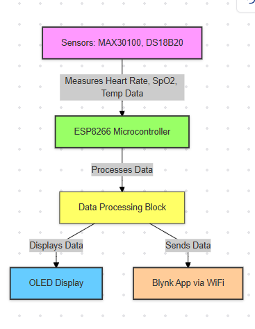
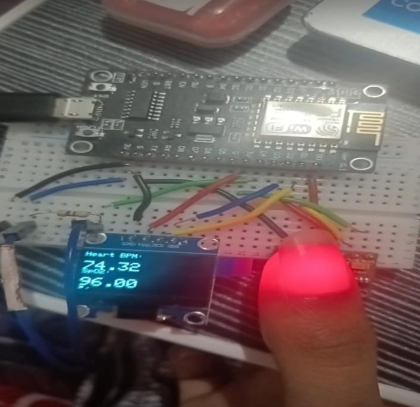

# ESP8266-Based Smart Healthcare Monitoring System

## Overview
This project is a **portable health monitoring system** developed using the ESP8266 microcontroller. It measures key health vitals including:
- **Body Temperature**
- **Blood Oxygen Saturation (SpO2)**
- **Heart Rate (BPM)**

The system leverages **biomedical sensors** to collect data, displays it locally on an **OLED screen**, and transmits it remotely via the **Blynk app**. This fusion of IoT and healthcare ensures accessible and effective real-time health tracking.

---

## Features
- **IoT Integration**: Real-time monitoring and remote access through Wi-Fi.
- **Biomedical Sensors**:
  - **MAX30100**: Measures SpO2 and heart rate.
  - **DS18B20**: Measures body temperature.
- **OLED Display**: Displays health metrics locally.
- **Blynk App**: Enables remote monitoring on smartphones.
- **Alerts**: Immediate notifications for anomalies in health metrics.

---

## Components
1. **Microcontroller**: NodeMCU ESP8266
2. **Sensors**:
   - MAX30100 (Pulse Oximeter and Heart Rate)
   - DS18B20 (Temperature Sensor)
3. **Display**: 128x64 OLED screen
4. **Software**: Blynk IoT platform
5. **Power Supply**: 3.3V

---

## System Design
### Block Diagram


### Circuit Diagram
!

---

## Methodology
1. Sensors collect health metrics (temperature, SpO2, BPM).
2. ESP8266 processes and displays data on the OLED screen.
3. Processed data is transmitted to the Blynk app over Wi-Fi.
4. Alerts are triggered for abnormal values, notifying caregivers.

---

## Getting Started
### Prerequisites
- NodeMCU ESP8266
- Arduino IDE with required libraries:
  - `MAX30100_PulseOximeter`
  - `DallasTemperature`
  - `Adafruit_GFX`
  - `OakOLED`
  - `BlynkSimpleEsp8266`

### Setup
1. Clone this repository:
   ```bash
   git clone https://github.com/ParasAV7/Health-Monitoring-System.git
   cd Code

Connect the sensors and OLED display to the NodeMCU as per the circuit diagram.
Configure your Wi-Fi credentials and Blynk authentication token in the code:
cpp
Copy
Edit
char ssid[] = "Your_SSID";
char pass[] = "Your_PASSWORD";
#define BLYNK_AUTH_TOKEN "Your_Blynk_Token"
Upload the code to NodeMCU using Arduino IDE.
Monitor health metrics on the OLED display and Blynk app.


## Results
- **Temperature**: Accurate readings displayed locally and remotely.
- **Heart Rate & SpO2**: Stable readings with consistent updates.
- **OLED & Blynk Integration**: Clear real-time display of health metrics.

---

## Future Enhancements
- Add additional sensors (ECG, blood pressure).
- Implement predictive analytics using AI/ML.
- Develop wearable versions for increased portability.
- Enhance data privacy with advanced encryption.

---

## Contributing
Contributions are welcome! Fork the repository and submit a pull request for review.

---

## License
This project is licensed under the **MIT License**. See the [LICENSE](LICENSE) file for details.

---

## Acknowledgments
Special thanks to:
- The **Department of Electronics and Communication Engineering, BMS College of Engineering**, and project guide **Dr. Shivkumar M** for their guidance and support.
- **Team members**:
  - **Pratik Gaurav**
  - **Purna S**
  - **Rachana N**

Your hard work and dedication made this project a success!

